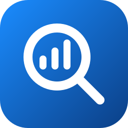
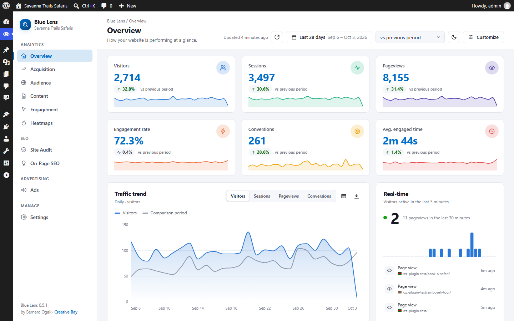
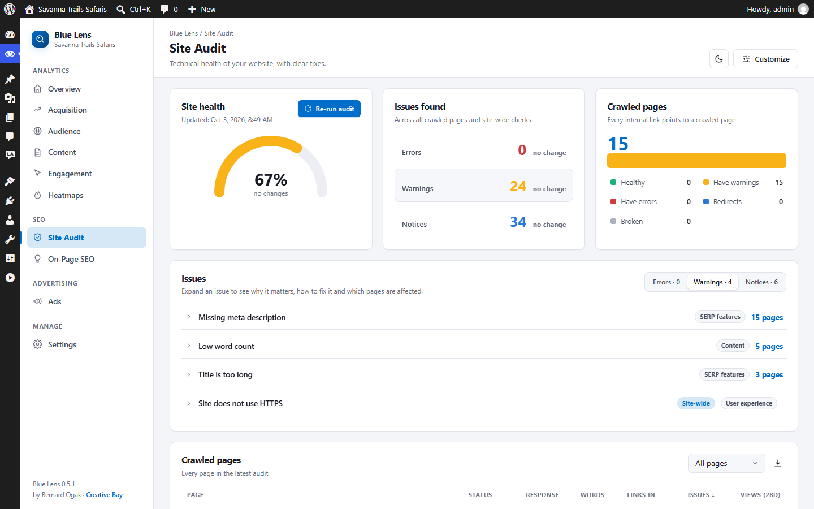
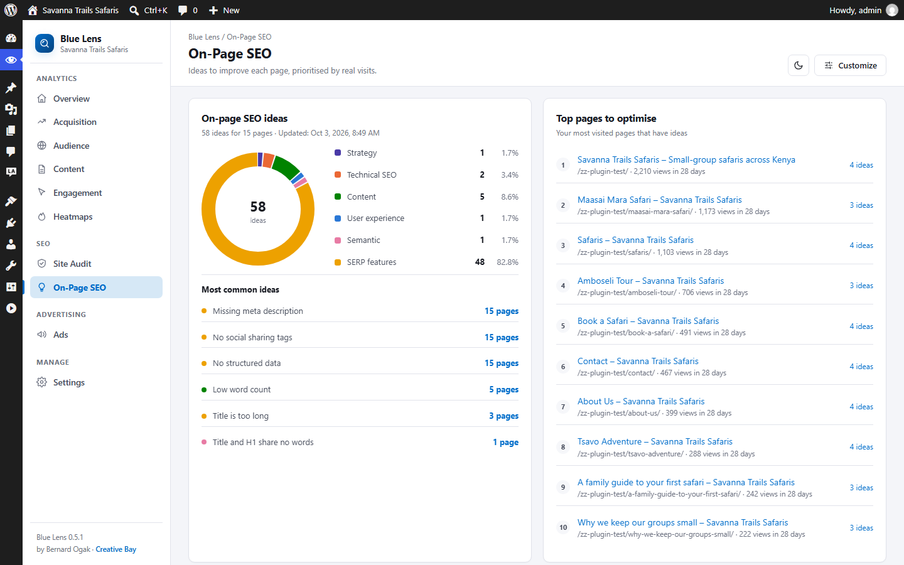
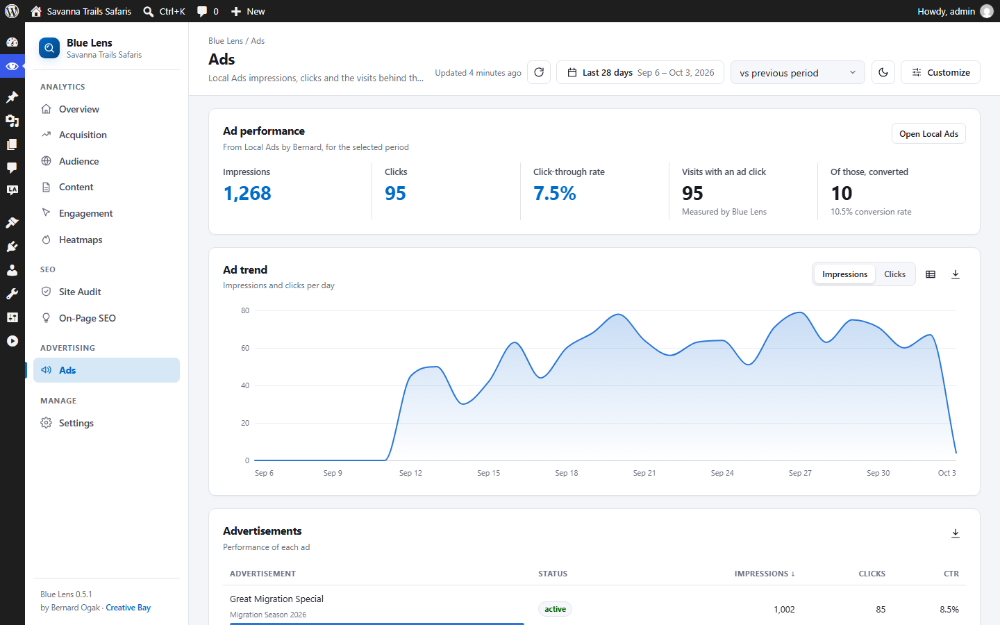
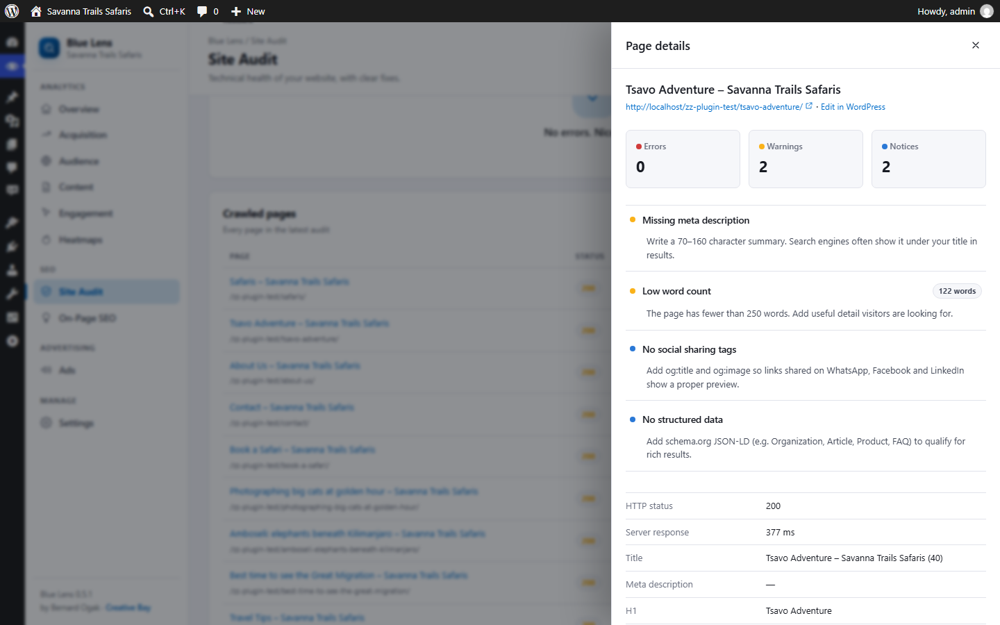
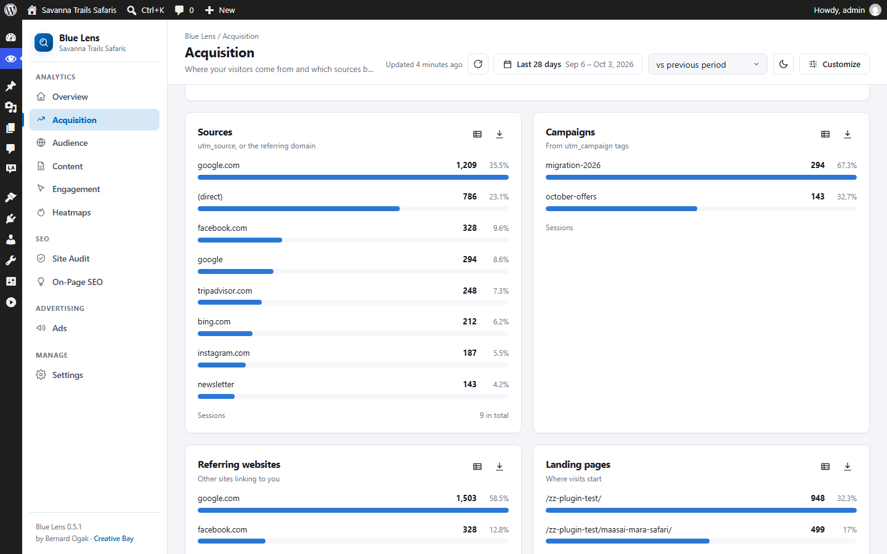
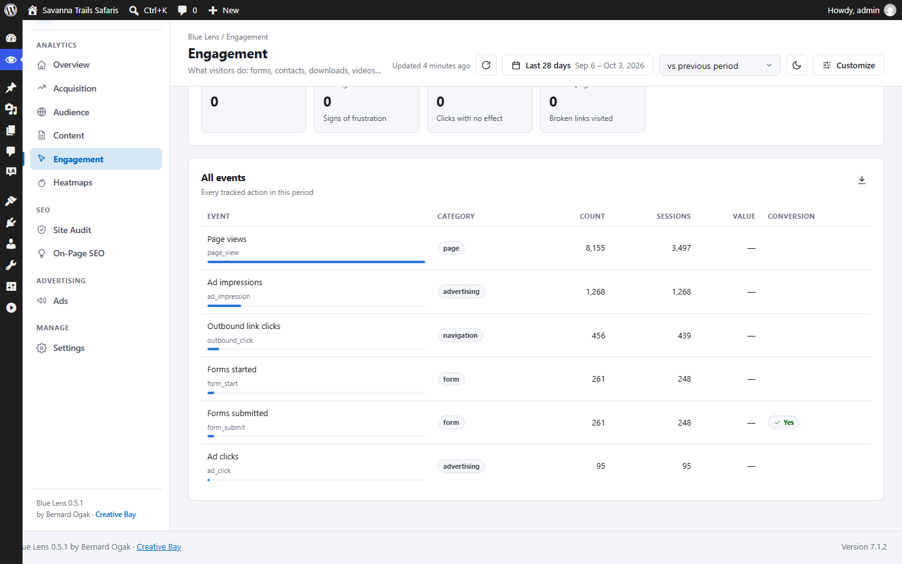
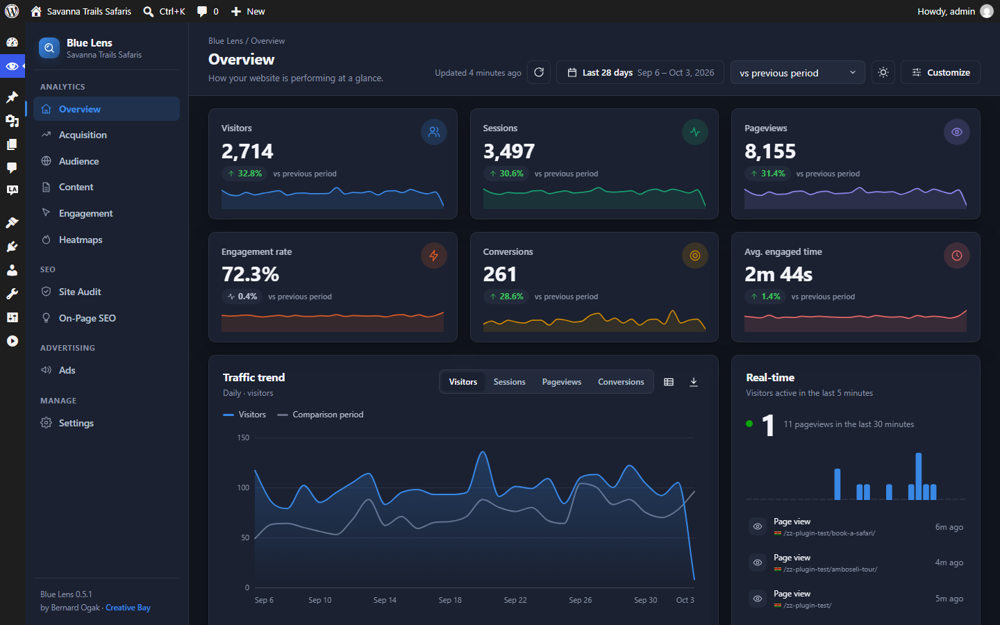
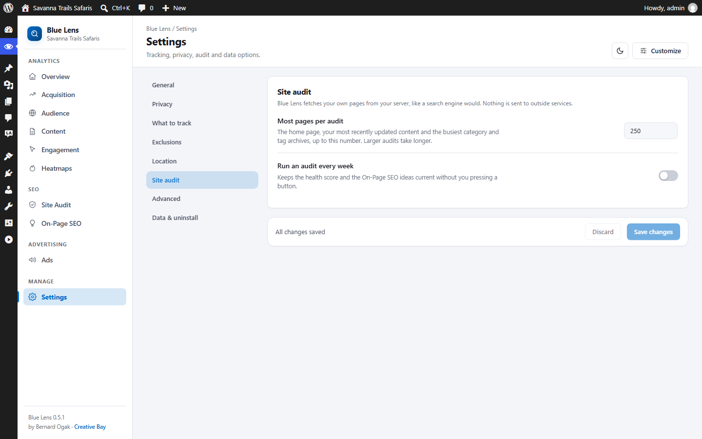

<p align="center">
  
</p>

<h1 align="center">Blue Lens Analytics</h1>

<p align="center">
  Privacy-first, self-hosted analytics and SEO site audit for WordPress.
</p>

<p align="center">
  <a href="LICENSE"></a>
  
  
  
</p>

<p align="center">
  <a href="https://www.creativebay.co.ke"></a><br>
  Built by Bernard Ogak · <a href="https://www.creativebay.co.ke">Creative Bay</a>
</p>

---

Blue Lens Analytics records how visitors find your website and what they do on it: pages viewed, time spent, clicks, forms, downloads, WhatsApp and phone taps, video plays, searches and more. It audits your site's technical and on-page SEO and tells you what to fix first. Everything is stored in your own WordPress database. It works without cookies by default, never stores IP addresses, and keeps working on fully cached pages.



## Features

**Analytics**

- **Cookieless by default.** Visitors are counted with an anonymous, daily-rotating code. Nothing is stored on the visitor's device and no raw IP address is kept.
- **Optional enhanced mode.** With the visitor's consent, a first-party cookie recognises returning visitors. It works with the WP Consent API and popular cookie banners.
- **Respects privacy signals.** Global Privacy Control switches a visitor to cookieless mode (or stops tracking, if you prefer), and Do Not Track can be honoured too.
- **Traffic sources that make sense for travel and services:** search, paid search, social, email, referral, AI assistants (ChatGPT, Perplexity, Gemini, Claude…) and OTA/listing sites (Booking.com, TripAdvisor, SafariBookings…).
- **Every interaction:** clicks on buttons and links, rage and dead clicks, outbound links, file downloads, phone/email/WhatsApp taps, video plays (YouTube, Vimeo, HTML5), site searches (including zero-result searches), 404 pages, JavaScript errors and page speed.
- **Form analytics without the data:** form starts, the last field reached before someone gives up, and successful submissions for Contact Form 7, Gravity Forms, WPForms, Fluent Forms, Elementor Forms, Formidable and Ninja Forms. Nothing a visitor types is recorded.
- **Click heatmaps**, stored as daily totals per page area.
- **Search engine and AI crawler log**: Googlebot, Bingbot, GPTBot, ClaudeBot, PerplexityBot and others, with the 404s they hit.

**Site Audit and On-Page SEO**

- Crawls your own pages from your server and checks more than 35 factors: broken pages and internal links, redirects, duplicate titles and descriptions, mixed content, missing H1, thin content, image alt text, canonical and noindex tags, structured data, social sharing tags, orphan pages, robots.txt, XML sitemap, HTTPS, soft 404s and more.
- A site health score, errors, warnings and notices with changes since the last audit, a crawled-pages breakdown and health history.
- On-Page SEO ideas grouped as strategy, technical SEO, content, user experience, semantic and SERP features, with your **most visited pages listed first**, using your own Blue Lens traffic.
- Plain-language fixes for every issue, page details with an "Edit in WordPress" link, CSV export, and an optional weekly audit. The audit runs on your own server and sends nothing to outside services.

**Local Ads by Bernard reporting**

- When [Local Ads by Bernard](https://github.com/Bernard-Ogak/local-ad) is active, an Ads page shows impressions, clicks and CTR by day, advertisement and campaign.
- With Local Ads 1.0.1 or later, ad clicks are linked to visits: see which channels and pages lead to ad clicks, and how many visitors who clicked an ad went on to convert.

**Dashboards**

- A clean sidebar layout with Overview, Acquisition, Audience, Content, Engagement, Heatmaps, Site Audit, On-Page SEO and Ads pages.
- Light and dark themes, six accent colours, and your choice of metric tiles and cards, in your order. Every chart has a table view and CSV export.
- Share reports with editors or clients without giving them settings access.
- Core tracking script under 4 KB gzipped, deferred, and compatible with WP Rocket, LiteSpeed Cache, W3 Total Cache, SiteGround Optimizer, Autoptimize and Cloudflare.
- JavaScript and PHP tracking APIs, a REST API, and actions and filters at every stage.

## Screenshots

The screenshots show a test site with generated demo traffic.

| | |
|---|---|
|  **Site Audit** |  **On-Page SEO** |
|  **Ads (Local Ads)** |  **Audit page details** |
|  **Acquisition** |  **Engagement** |
|  **Dark theme** |  **Settings** |

## Requirements

- WordPress 6.4 or later (single site or multisite)
- PHP 8.1 or later, with the DOM extension (standard in PHP) for the site audit
- MySQL 5.7+ or MariaDB 10.3+
- The site must be able to request its own pages over HTTP(S) for the site audit (true on almost all hosts)

## Installation

**From the release ZIP (recommended)**

1. Download `blue-lens-analytics.zip` from the [latest release](https://github.com/Bernard-Ogak/blue_lens_analytics/releases/latest).
2. In WordPress go to **Plugins → Add New Plugin → Upload Plugin**, choose the ZIP and click **Install Now**.
3. Click **Activate Plugin**.

**With Git**

The plugin folder must be named `blue-lens-analytics`:

```bash
cd wp-content/plugins
git clone https://github.com/Bernard-Ogak/blue_lens_analytics.git blue-lens-analytics
```

Then activate **Blue Lens Analytics** under **Plugins**.

Optional: run `composer install --no-dev` in the plugin folder to add the MaxMind reader (for GeoIP locations) and Action Scheduler (for background jobs; WP-Cron is used without it). See [docs/installation.md](docs/installation.md).

## Quick start

1. Visit your site in a private window (administrators and editors are not tracked by default).
2. Open **Blue Lens → Dashboard** and press **Refresh**. Your visit appears within seconds.
3. Open **Site Audit** and click **Run first audit**. A small site takes under a minute.
4. Open **On-Page SEO** to see what to improve on your most visited pages.

## Documentation

| Document | What it covers |
|---|---|
| [docs/user-guide.md](docs/user-guide.md) | Using the dashboard, Site Audit, On-Page SEO, Ads, what is tracked, settings, troubleshooting |
| [docs/developer-guide.md](docs/developer-guide.md) | JavaScript and PHP APIs, REST endpoints, hooks, database schema, building a release |
| [docs/installation.md](docs/installation.md) | Requirements, installing, upgrading, uninstalling, GeoIP set-up |
| [docs/privacy.md](docs/privacy.md) | Exactly what is collected, legal notes, and privacy-policy text you can adapt |
| [docs/faq.md](docs/faq.md) | Frequently asked questions |
| [CHANGELOG.md](CHANGELOG.md) | Version history |
| [THIRD-PARTY-NOTICES.md](THIRD-PARTY-NOTICES.md) | Licences of optional libraries and data sources |
| [TERMS.md](TERMS.md) | Terms for support, updates and services |
| [SECURITY.md](SECURITY.md) | How to report a security issue |

## Building a release ZIP

```powershell
powershell -ExecutionPolicy Bypass -File bin/build-zip.ps1
```

This writes `dist/blue-lens-analytics.zip` with a single top-level `blue-lens-analytics/` folder and leaves out repository-only files (docs, tests, build tooling). Details: [docs/developer-guide.md](docs/developer-guide.md#building-and-testing).

## Contributing

Bug reports and pull requests are welcome on [GitHub](https://github.com/Bernard-Ogak/blue_lens_analytics/issues). Please describe how to reproduce a bug (WordPress and PHP versions, active theme and plugins). For pull requests, follow the WordPress coding standards (`composer lint`), keep changes focused, and update the documentation and changelog. Report security issues privately as described in [SECURITY.md](SECURITY.md).

## License

Blue Lens Analytics is free software, released under the [GNU General Public License v2 or later](LICENSE). Optional libraries and data sources have their own licences, listed in [THIRD-PARTY-NOTICES.md](THIRD-PARTY-NOTICES.md).

Copyright © 2026 Bernard Ogak, Creative Bay
